# 外部ネットワークからの全てのアクセスを制限した限定公開クラスタを作成し、踏み台サーバーからkubectlする

## これは何？
- GCPでVPCとsubnetを作成します
- subnet内に限定公開クラスタを作成します
  - 各ノードが外部IPアドレスを持たなくなります
- コントロールプレーンへのアクセス制限をかけ、全ての外部ネットワークからのアクセスを拒否します
  - 外部ネットワークからkubectlコマンドが使えなくなります
- subnet内に踏み台サーバーとしてVMインスタンスを起動します
- 踏み台サーバー踏み台サーバーにIAPを用いてSSH接続します
- 踏み台サーバーから、GKEクラスタに対してkubectlコマンドを実行します

## 解説記事
https://zenn.dev/nekoshita/articles/90b7b13caf5fd2

## 構成図


## セットアップ
- `Terraform v0.14.5`のインストール
  - https://releases.hashicorp.com/terraform/
- Google Cloud Platformのprojectを作成する
  - https://cloud.google.com/resource-manager/docs/creating-managing-projects
- GCP StorageのBucketを作成する
  - https://cloud.google.com/storage/docs/creating-buckets
- `gcloud CLI`のインストール（VMインスタンスにSSH接続したい場合）
  - https://cloud.google.com/sdk/gcloud


## リソースの作成
```
$ export GCP_PROJECT_ID="your-gcp-project-id"
$ export GCS_BUCKET_NAME="your-gcs-bucket-name"
$ export USER_MAIL="your-google-user-mail-to-allow-ssh-acccess@gmail.com"

$ bin/apply $GCP_PROJECT_ID $GCS_BUCKET_NAME $USER_MAIL
```

## リソースの削除
```
$ export GCP_PROJECT_ID="your-gcp-project-id"
$ export GCS_BUCKET_NAME="your-gcs-bucket-name"
$ export USER_MAIL="your-google-user-mail-to-allow-ssh-acccess@gmail.com"

$ bin/destroy $GCP_PROJECT_ID $GCS_BUCKET_NAME $USER_MAIL
```

## 作成したクラスタにkubectlコマンドを実行する
```
$ export ZONE="asia-northeast1-a"
$ export VM_INSTANCE_NAME="bastion"
$ export GCP_PROJECT_ID="your-gcp-project-id"

# GCPのprojectを作成したgoogleアカウントでログインする（すでにログインしてる場合は不要）
$ gcloud auth login

# IAPを利用して踏み台サーバーにSSH接続する
$ gcloud beta compute ssh --zone $ZONE $VM_INSTANCE_NAME --project $GCP_PROJECT_ID --tunnel-through-iap

# kubectlコマンドをインストールする
$ sudo apt install kubectl

# クラスタの認証情報を取得する
$ gcloud container clusters get-credentials my-cluster --zone asia-northeast1-a

# podを取得できるかためしてみる
$ kubectl get pod --all-namespaces
```
